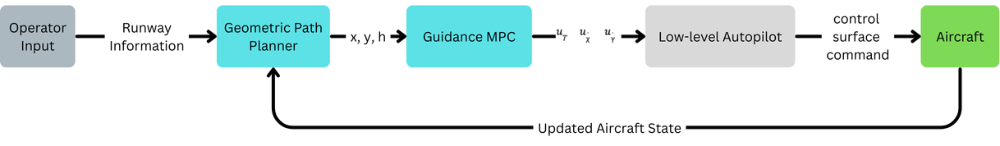
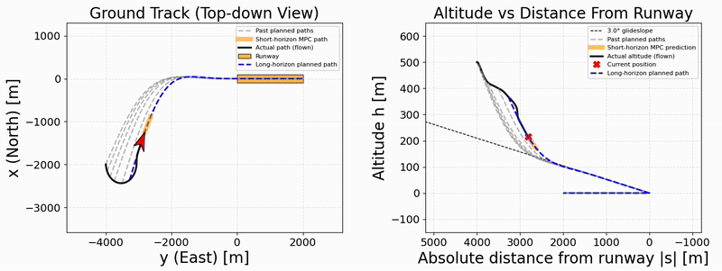

# Damaged Aircraft MPC Guidance Controller

This project explores how **Model Predictive Control (MPC)** can provide **high-level guidance** to a **damaged aircraft** using only a **3D kinematic model**.

Developed as the final project for **UC Berkeley MECENG 231A – Model Predictive Control**.

📄 **Project Report (PDF):** describes the two-layer guidance stack (long-horizon geometric planner + short-horizon MPC) and simulation results.  
[Read the report](docs/mpc_231a_final_report.pdf)

---

## Overview

The controller outputs *guidance commands* (desired longitudinal acceleration, turn-rate, and climb-angle rate), which are assumed to be tracked by an **ideal lower-level autopilot**.

The core idea is a **two-layer guidance stack**:

1) **Long-horizon geometric planner (convex QP)**  
   Generates a smooth, runway-aligned 3D waypoint reference to the runway threshold.

2) **Short-horizon guidance MPC (convex QP, LTV)**  
   Tracks a local segment of the reference while enforcing constraints and handling degraded authority.

Unlike “replan every step” architectures, the planner **only replans when the MPC declares the current plan infeasible**.

  

---

## Model

### 3D Kinematic Point-Mass Model (Guidance Level)

State:

$$
x = [x,\ y,\ h,\ V,\ \chi,\ \gamma]^T
$$

<table>
  <thead>
    <tr>
      <th>State</th>
      <th>Meaning</th>
      <th>Units</th>
    </tr>
  </thead>
  <tbody>
    <tr><td><code>x</code></td><td>North position in world frame</td><td>meters</td></tr>
    <tr><td><code>y</code></td><td>East position in world frame</td><td>meters</td></tr>
    <tr><td><code>h</code></td><td>Altitude</td><td>meters</td></tr>
    <tr><td><code>V</code></td><td>Airspeed magnitude</td><td>m/s</td></tr>
    <tr><td><code>χ</code></td><td>Heading angle (0° = North, 90° = East)</td><td>radians</td></tr>
    <tr><td><code>γ</code></td><td>Climb angle</td><td>radians</td></tr>
  </tbody>
</table>

Kinematics:

$$
\dot{x} = V\cos\gamma\cos\chi,\qquad
\dot{y} = V\cos\gamma\sin\chi,\qquad
\dot{h} = V\sin\gamma
$$

$$
\dot{V} = u_{accel},\qquad
\dot{\chi} = u_{\dot{\chi}},\qquad
\dot{\gamma} = u_{\dot{\gamma}}
$$

Inputs (tracked by ideal autopilot):
- $u_{accel}$: longitudinal acceleration command ($\mathrm{m/s^2}$)
- $u_{\dot{\chi}}$: heading-rate command (rad/s)
- $u_{\dot{\gamma}}$: climb-angle-rate command (rad/s)

### Linearization for MPC (LTV)

At each control iteration, the nonlinear kinematics are linearized about the current operating point and discretized (e.g., forward Euler) to form an LTV prediction model:

$$
x_{k+1} = A_d x_k + B_d u_k
$$

---

## Guidance Architecture

  

### Long-Horizon Geometric Planner (Convex QP)

The planner solves a convex QP over the stacked waypoint decision vector:

$$
z = [x_0,\ y_0,\ h_0,\ \ldots,\ x_N,\ y_N,\ h_N]^T
$$

Define $p_i = [x_i,\ y_i,\ h_i]^T$. The objective is composed of four geometric terms:

$$
J = J_{\mathrm{smooth}} + J_{\mathrm{gs}} + J_{\mathrm{lat}} + J_{\mathrm{align}}
$$

**Smoothness (second finite differences):**

$$
J_{\mathrm{smooth}} = w_{\mathrm{smooth}} \sum_{i=1}^{N-1} \left\| p_{i+1} - 2p_i + p_{i-1} \right\|_2^2
$$

**Glide-slope shaping (altitude tracking to a glide reference):**

$$
J_{\mathrm{gs}} = W_{\mathrm{GS}} \sum_{i=0}^{N} w_i\,(h_i - h_{\mathrm{ref},i})^2
$$

**Runway centerline shaping (cross-track penalty):**

$$
J_{\mathrm{lat}} = W_{\mathrm{LAT}} \sum_{i=0}^{N} w_i\,c_i^2
$$

**Terminal runway heading alignment (penalize heading misalignment near runway):**  
Let $(d_x, d_y)$ be the runway unit direction in the world frame. Over the terminal segment:

$$
J_{\mathrm{align}} = W_{\mathrm{align}} \sum_{i=i_{\mathrm{align}}}^{N-1} w_i\left( (x_{i+1}-x_i)d_y - (y_{i+1}-y_i)d_x \right)^2
$$

In implementation, the waypoint weights $w_i$ are increased as the trajectory approaches the runway (e.g., $w_i=(i/N)^2$), emphasizing glide-slope and centerline tracking near touchdown.

**Replanning policy:** the planner is called only when the short-horizon MPC flags the current plan as infeasible.

---

### Short-Horizon Guidance MPC (Convex QP, LTV)

Tracks a short window of the planned reference while enforcing:
- **state bounds**
- **input bounds**
- **input rate bounds**

The MPC solves a convex quadratic program over a finite horizon to track the planner reference while minimizing control effort:

$$
J = \sum_{k=0}^{N}\left[(x_k - x_k^{\mathrm{ref}})^T Q (x_k - x_k^{\mathrm{ref}}) + u_k^T R u_k\right]
$$

where $x_k$ and $u_k$ are the predicted state and input at step $k$, and $x_k^{\mathrm{ref}}$ is the reference provided by the path planner.

**Reference construction:** the planner provides position/altitude waypoints directly, and the MPC primarily penalizes tracking error in $(x, y, h, V)$. Desired angles $(\chi, \gamma)$ are derived from the local path direction (finite-difference gradients) between successive waypoints.

---

## Damage + Mode Switching

### Degraded Control Authority (Damage Mode)

Damage is modeled by **tightening input bounds** (and potentially tightening the allowable \(\gamma\) envelope mid-flight) while keeping the same kinematic model. This can render the original runway plan infeasible.

### Tracking Feasibility → Replan Triggers

During flight, the MPC monitors feasibility using:
- a **cross-track error accumulation counter**, and
- a **progress-stall detector** based on insufficient along-path progress.

If triggers persist for several consecutive steps, the current plan is declared infeasible and the planner replans.

### Runway Unreachable → Crash Landing Mode

If (after damage) runway landing is declared infeasible, the system switches to a **secondary reference + MPC structure**:

1) **Online reachability check**  
   Compare remaining horizontal distance along the planned approach polyline vs. maximum achievable horizontal range computed from altitude and shallowest allowable descent.

2) **Crash touchdown selection with no-land zones (ellipses)**  
   The long-horizon planner selects a feasible touchdown point within remaining range while avoiding no-land ellipses by scanning bearings about current heading and rejecting candidates that intersect restricted regions. If the aircraft starts inside a no-land ellipse, an intermediate “escape waypoint” is generated just outside the ellipse boundary.

3) **Crash landing MPC**  
   Tracks the crash polyline using the same convex QP structure, with an added terminal/near-ground penalty encouraging reduced vertical impact severity.

   
  <em>
    Damaged-mode response: after damage, the controller enforces a constrained flight-path angle
    (climb angle) of −30° ≤ γ ≤ −10° and replans to a feasible touchdown.
  </em>

---

## Repository Entry Points

- `flight_control_mpc/path_planner.py` — long-horizon planner + crash planner
- `flight_control_mpc/guidance_mpc.py` — short-horizon MPC + feasibility logic
- `flight_control_mpc/aircraft_model.py` — nonlinear kinematic model + linearization
- `flight_control_mpc/test.py` — runnable scenarios / demos
- `flight_control_mpc/plot.py`, `flight_control_mpc/animation.py` — visualization